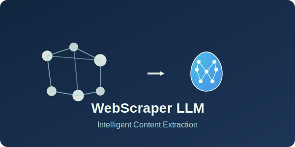

# Web Scraper with Llama 3.1 Content Extraction

<p align="center">
  
</p>

<h3 align="center">🚀 A Powerful Local API Solution for Web Scraping and Content Extraction</h3>

This tool scrapes web pages and uses the Llama 3.1 language model to extract meaningful content from HTML, all running **completely locally** on your machine. No external API calls or cloud services required!

## ✨ Key Features

- **100% Local Processing**: All processing happens on your machine with no data sent to external servers
- **REST API Interface**: Easy to integrate with your applications or scripts
- **Privacy-Focused**: Your scraped data never leaves your computer
- **No API Keys Required**: No subscription fees or rate limits
- **Llama 3.1 Powered**: Utilizes the powerful Llama 3.1 model for intelligent content extraction
- **Multiple Extraction Modes**: Content, summary, or structured information

## 📋 Content Processing Capabilities

- **Content mode**: Extracts clean, readable text from cluttered HTML
- **Summary mode**: Creates concise summaries of web content
- **Info mode**: Pulls key information in a structured format (title, topics, key points)

## 🛠️ Requirements

- Python 3.8+
- Llama 3.1 model in GGUF format 
- 8+ GB RAM recommended (depending on model size)
- CUDA-compatible GPU recommended but not required

## 📥 Installation

1. Clone this repository:
   ```
   git clone https://github.com/Shivp1413/web-scraper-llama
   cd web-scraper-llama
   ```

2. Install dependencies:
   ```
   pip install -r requirements.txt
   ```

3. Download Llama 3.1 model:
   Download a GGUF version of Llama 3.1 from a reputable source and place it in the `models` directory.
   
   Example sources:
   - TheBloke's HuggingFace repositories
   - Official Meta Llama download (requires conversion to GGUF)

4. Update the model path in `main.py` to point to your downloaded model.

## 🚀 Running the API Server

Start the FastAPI server with a single command:

```
python main.py
```

The API will be available at http://localhost:8000

## 📝 API Documentation

Once the server is running, visit http://localhost:8000/docs for interactive API documentation.

### Endpoints

- `GET /` - Check if the API is running
- `POST /scrape` - Scrape and extract content from a URL
- `GET /models` - Get information about the loaded model

## 🖥️ Using the Client

The included client script provides a convenient way to use the API:

```
python client.py https://example.com --mode content --output result.json
```

Options:
- `url` - The URL to scrape (required)
- `--mode` - Extraction mode: "content", "summary", or "info" (default: "content")
- `--output` - Save the full result to a JSON file (optional)

## 🐳 Docker Support (Optional)

Build the Docker image:

```
docker build -t web-scraper-llama .
```

Run the container:

```
docker run -p 8000:8000 -v $(pwd)/models:/app/models web-scraper-llama
```

## ⚙️ Configuration

Edit `main.py` to customize:
- Model parameters (context size, layers, etc.)
- API settings
- Prompt templates for different extraction modes

## 🔍 Project Structure

```
web-scraper-llama/
│
├── main.py             # Main FastAPI application
├── client.py           # Command-line client for interacting with the API
├── requirements.txt    # Python dependencies
├── Dockerfile          # Instructions for Docker containerization
├── logo.svg            # Project logo
├── README.md           # Documentation
│
└── models/             # Directory to store your Llama 3.1 model
    └── (your-llama-model.gguf)
```

## 🔧 Troubleshooting

- **Model Loading Issues**: Ensure the model path is correct and the GGUF file is compatible with llama-cpp-python
- **Memory Errors**: Try a smaller quantized model or increase system RAM
- **Slow Performance**: Enable GPU acceleration if available by setting `n_gpu_layers` appropriately

## ⚖️ License

MIT

---

<p align="center">Created with ❤️ by <a href="https://github.com/Shivp1413">Shivp1413</a></p>
